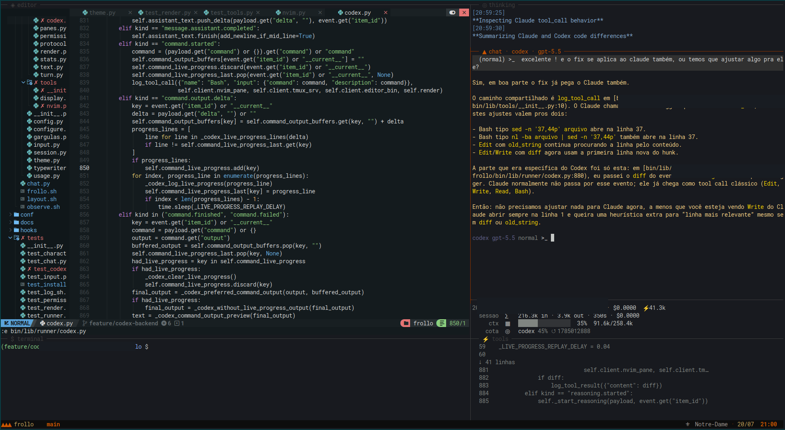
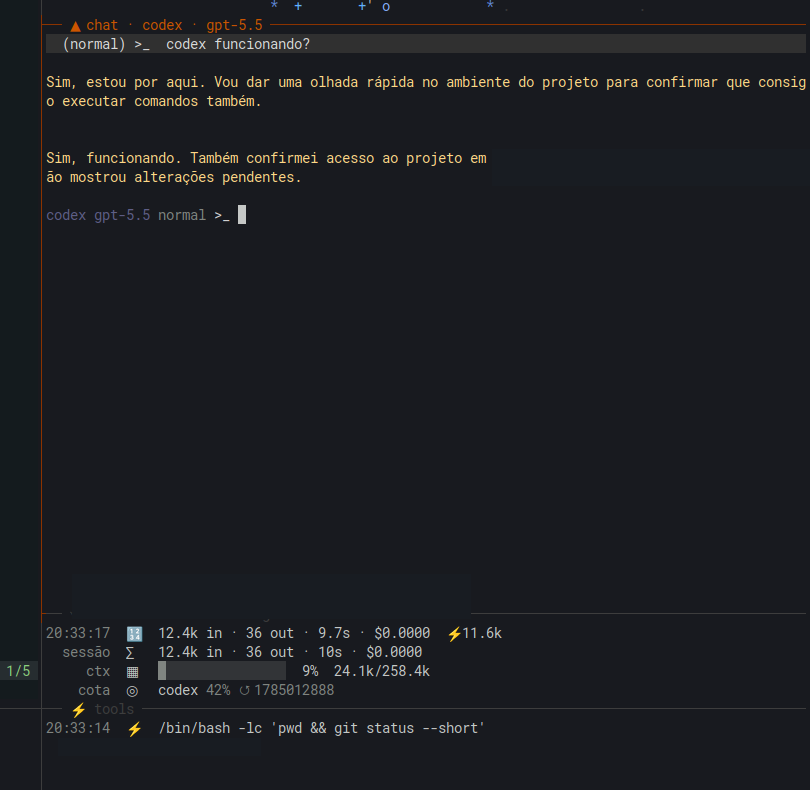
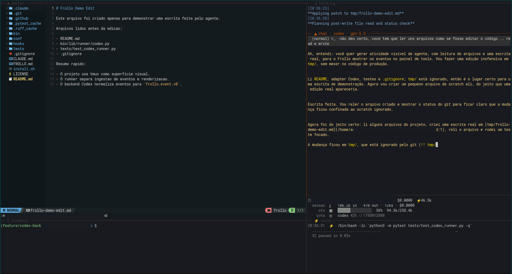
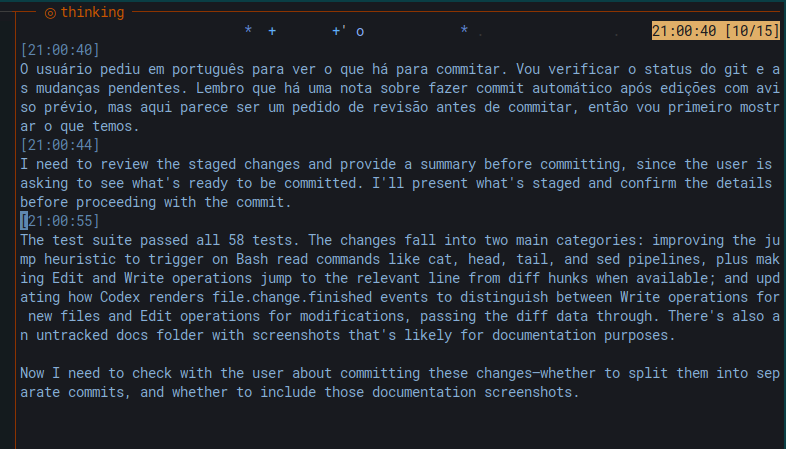

# Frollo

[](https://github.com/arthurtabbal/frollo/actions/workflows/ci.yml)

> **A human-first observability layer for coding agents.**

Coding agents are becoming increasingly capable.

They're also becoming increasingly difficult to follow.

While an agent is thinking, exploring files, executing tools and rewriting your code, most interfaces reduce all of that to a blinking cursor and a few lines of conversation.

Frollo takes a different approach.

Instead of asking the agent to be more autonomous, it asks a simpler question:

> **What is the agent actually doing right now?**



---

## What is Frollo?

Frollo is an observability layer for coding agents.

Today it integrates primarily with **Claude Code**, capturing its structured event stream and presenting it through a terminal interface designed for real-time inspection.

An experimental **Codex App Server** backend is also available. It is the first second-provider adapter and the current proving ground for Frollo's canonical event protocol.

Rather than treating the agent as a black box, Frollo exposes its execution in a way that's easier to understand, debug and trust.

Think of it as somewhere between:

* `top` for your coding agent;
* a flight recorder;
* a debugger;
* and, occasionally, a concerned gargoyle.

---

## Features

* **Thinking, live** — the model's reasoning streams into its own pane as it happens.
* **Tool monitoring** — every tool call rendered in real time, in its own pane, with occasional commentary from three gargoyles.
* **Execution statistics** — tokens, cost, context window and subscription quota, per turn and per session.
* **Passive observer** — a system-wide hook captures every Claude Code session on the machine into an append-only JSONL event log; `observe.sh` tails and renders the stream.
* **Typewriter pacing** — output is paced so you can follow the agent in real time instead of staring at a spinner and then receiving a wall of text. Any keypress skips ahead.
* **tmux-native** — the interface is just tmux panes: editor, chat, thinking, tools, stats.
* **Loud failures** — errors never die quietly: they land in the chat, expand the tools pane with the details, and append to `~/.config/frollo/errors.jsonl`.
* **Session picker** — resume any previous session interactively.
* **Experimental Codex backend** — run the same terminal interface against `codex app-server` with `--backend codex`.

## In Action

The interface is split into live panes: chat output, thinking/reasoning, tool execution, session statistics and the editor itself.



Agents can read, edit and test while Frollo keeps the activity visible in real time.



The thinking pane gives long-running turns a shape you can follow instead of hiding them behind a spinner.



---

## Requirements

* [Claude Code](https://claude.ai/code) CLI (`claude`)
* Codex CLI (`codex`) for the experimental Codex backend
* `tmux` ≥ 3.1
* Python 3.10+
* `jq` 1.6+
* `nvim` (optional — editor pane)

## Install

```bash
git clone https://github.com/arthurtabbal/frollo
cd frollo
./install.sh
```

`install.sh` registers the observer hooks in `~/.claude/settings.json` (merging safely with any hooks you already have) and symlinks `frollo` into `~/.local/bin`.

## Usage

```bash
frollo                        # full layout in the current directory
frollo /path/to/project       # full layout in a specific project
frollo --backend codex        # experimental Codex App Server backend
./bin/observe.sh              # passive observer only: the raw event stream,
                              # from every Claude Code session on the machine
```

The full layout opens a tmux session:

```
┌──── nvim editor ───────────────────┬──── thinking ─────────────────────┐
│                                    │                                    │
│              60%                   ├──── chat ──────────────────────────┤
│                                    ├──── stats (Rio Sena) ──────────────┤
├──── terminal ──────────────────────├──── tools ─────────────────────────┤
│              30%                   │                                    │
└────────────────────────────────────┴────────────────────────────────────┘
```

### Client commands

| Key / Command | Effect |
|---|---|
| `/snapshot` | Capture current visual state and send it to the agent |
| `/paste` | Open `$EDITOR` for long text; sends on close |
| `/refresh` | Restart, resuming the current session |
| `/new` | Restart with a fresh context |
| `/model [name]` | Show or switch model (`opus`/`sonnet`/`haiku` or full ID) |
| `Shift+Tab` | Toggle Normal ↔ Auto mode |
| `Alt+Enter` | Insert newline (multiline input) |
| `Ctrl+V` | Paste an image from the clipboard |
| `Ctrl+C` | Cancel the running turn (or clear the line if idle) |
| `Ctrl+D` | Exit |

---

## Design Principles

### Human-first

Coding agents should amplify developers, not replace them.

The human remains part of the loop.

### Observe before optimizing

It's difficult to improve a system you cannot see.

Visibility comes first.

### Everything is an event

Thinking. Tool calls. File operations. Statistics.

If it happens, it should be observable.

### Terminal-native

Frollo embraces the Unix philosophy.

It integrates with terminals, tmux and existing developer workflows instead of replacing them.

### Standard library only

The Python code depends exclusively on the standard library.

pip is the main supply-chain attack vector in Python, and the easiest dependency to audit is the one you don't have. There is no `requirements.txt`, and there won't be.

---

## Architecture

```
Passive observer:
Claude Code (any session)
  → PreToolUse / PostToolUse hooks (async)
    → ~/.claude/observer.jsonl (append-only)
      → observe.sh (tail -f | jq)

Active client:
chat.py
  → Claude adapter or Codex adapter
    → Frollo events    →  existing panes
    → text deltas      →  chat pane (typewriter)
    → reasoning        →  thinking pane
    → tool events      →  tools pane + gargoyles
    → usage / quota    →  stats pane
```

Hooks are async and the log is append-only: the observed system never waits on the observer.

Simple on purpose.

---

## The Gargoyles

Three chimeras from the cathedral comment on what they observe — inspired by the chimeras Victor Hugo describes, among which Quasimodo lives.

* **Victor** (purple) — pompous, theatrical.
* **Hugo** (green) — bored, hungry.
* **Gudule** (lilac) — nihilistic, melancholic.

Each gargoyle is a JSON file in `bin/characters/` with a name, a color and lines keyed by event category. Adding a fourth requires no code changes. None of them does anything computationally useful, and that is fine.

---

## Roadmap

The roadmap focuses on expanding observability rather than replacing existing coding agents.

Planned and exploratory work is tracked in the issues:

* [Behavioral agent metrics](https://github.com/arthurtabbal/frollo/issues/1) — characterize *how* an agent works, not just whether it succeeded.
* [Canonical event protocol](https://github.com/arthurtabbal/frollo/issues/2) — decouple the UI from agent-specific event schemas.
* [Adapter architecture & capabilities](https://github.com/arthurtabbal/frollo/issues/3) — graceful degradation across agents that expose different information.
* [OpenTelemetry ingestion](https://github.com/arthurtabbal/frollo/issues/4) — consume GenAI traces as an event source.
* [Experimental native runtime](https://github.com/arthurtabbal/frollo/issues/5) — validate the protocol by producing events, not just consuming them.
* [The umbrella vision](https://github.com/arthurtabbal/frollo/issues/6) — agent-agnostic observability.
* [Codex App Server Adapter](https://github.com/arthurtabbal/frollo/issues/7) — first second-provider backend.

Every item serves the same objective:

> Make coding agents easier to understand.

More features are planned. The backlog grows faster than the codebase.

---

## Long-Term Vision

Today, Frollo is built around Claude Code.

Tomorrow, it may support multiple coding agents through a common event model.

The long-term goal is not to build yet another IDE.

Editors already exist. Coding agents already exist.

Frollo explores a different space: helping humans understand, inspect and collaborate with autonomous software engineering systems.

If the future belongs to coding agents, they shouldn't remain black boxes.

---

## Theme

Frollo draws its visual identity and terminology from Victor Hugo's *The Hunchback of Notre-Dame* (1831), which is in the public domain. The Disney adaptation (1996) is not — no lyrics or visual designs from that version are used.

No actual cathedrals were modified during development.

---

## Contributing

Ideas, bug reports and pull requests are always welcome.

Whether you're interested in terminals, observability, coding agents, or simply enjoy watching autonomous software think out loud, you're in good company.

---

## License

MIT — see [LICENSE](LICENSE).
